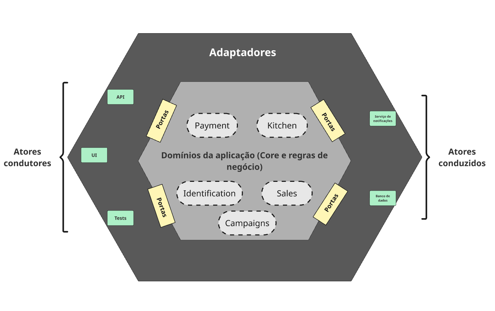

# Tech Challenge - Sistema de Autoatendimento de Lanchonete - Grupo 186

## ✏️ Descrição

Sistema backend desenvolvido como parte de um **Tech Challenge acadêmico**, com foco em resolver problemas de gestão de pedidos, atendimento e controle de produtos para uma lanchonete em expansão.


## 📌 Objetivo

Criar um sistema backend de autoatendimento de fast food, permitindo:
- Realização e acompanhamento de pedidos
- Integração com API de pagamento do Mercado Pago
- Cadastro e identificação de clientes
- Gerenciamento de produtos e categorias
- Visualização de pedidos em tempo real pela cozinha e pelos clientes

## 🛠️ Estrutura do Projeto
Este projeto segue a **Arquitetura Hexagonal** (Ports and Adapters), inspirada nos princípios descritos no blog técnico da Netflix: _“[Ready for changes with Hexagonal Architecture](https://netflixtechblog.com/ready-for-changes-with-hexagonal-architecture-b315ec967749)”._

Os principais contextos do domínio são:
* **Payment:** Contexto responsável pela realização e confirmação de pagamento, também responsável pela integração com parceiros.
* **Kitchen:** Contexto responsável pela criação e atualização de um pedido durante seu preparo e entrega.
* **Identification:** Contexto responsável pela identificação e cadastro do pedido.
* **Sales:** Contexto responsável pela criação e seleção dos produtos contidos no pedido.
* **Campaigns:** Contexto  responsável pela criação de campanhas da lanchonete.


## 📝 Requisitos

- Java 21
- Docker
- Docker Compose

## ⚙️ Como executar o projeto localmente
1. Clone o repositório:
```bash
git clone https://github.com/seu-usuario/seu-repo.git
cd seu-repo
```
2. Compile o projeto (geração do JAR):
```bash
mvn clean package
```
3. Subir container
```bash
docker-compose up
```
